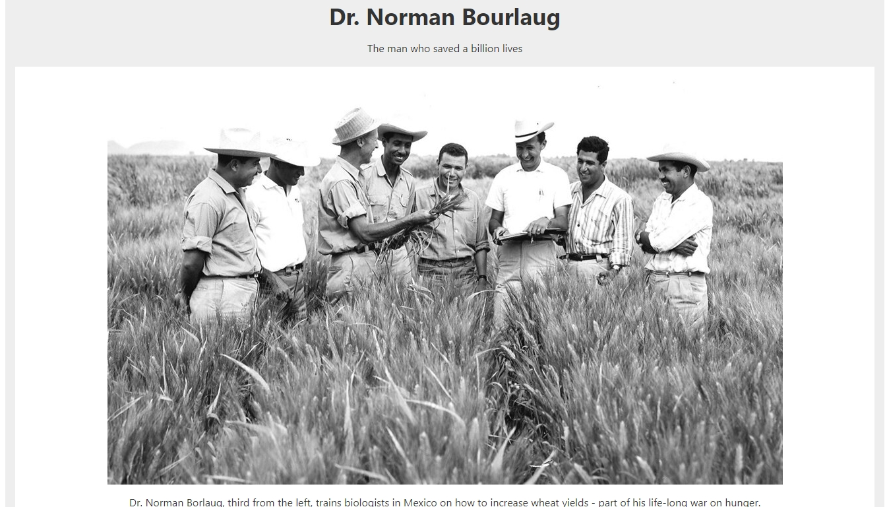
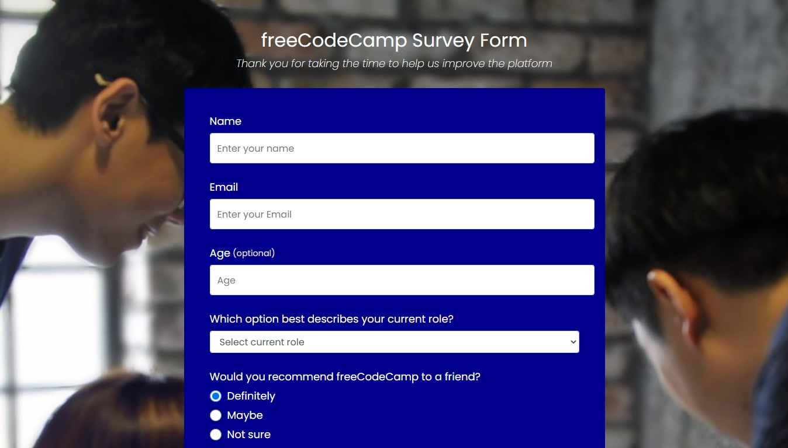
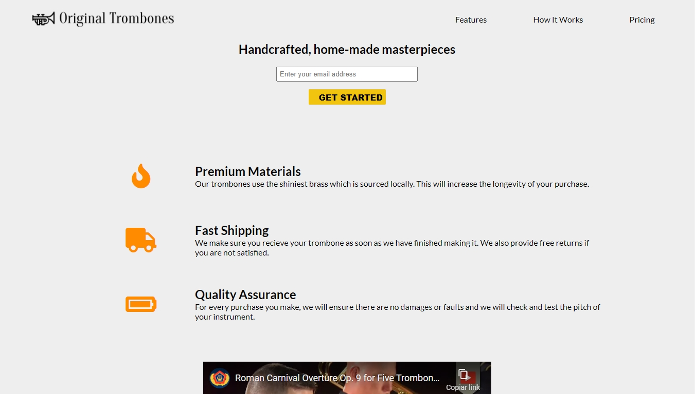
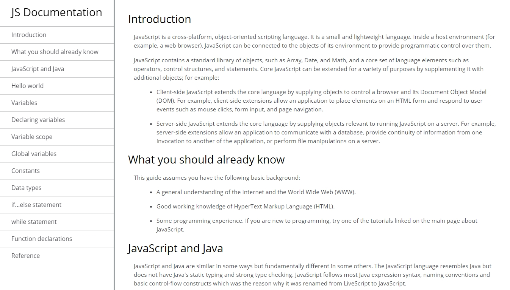
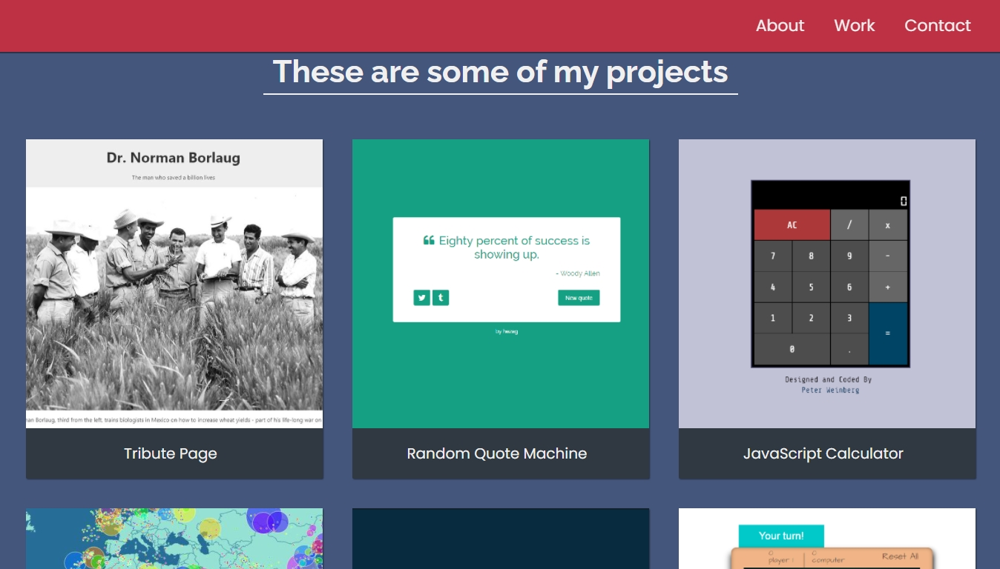

<h1 align="center">:books: Projetos do Freecodecamp :books:</h1>

<p align="center">

</p>

<p align="center">Olá! Seja bem-vindo ao meu repositório de projetos realizados durante meu aprendizado nos desafios do site freecodecamp.</p>

<p align="center"><a href="https://www.freecodecamp.org">Link do site</a></p>

<h2 align="center"> :computer: Tecnologias Utilizadas :computer:</h2>

<p align="center">
  
  
</p>

<h2 align="center">:rocket: Projetos Desenvolvidos :rocket:</h2>

<details>
  <summary>Tribute Page</summary>
  <p>Um desafio no qual foi proposto criar uma página de homenagem.</p>
  <p align="center"></p>
  <p align="center"><a href="https://github.com/matheusz98/projetos-freecodecamp/tree/master/Projeto%20Tribute%20Page">Link do projeto</a></p>
</details>

<details>
  <summary>Survey Form</summary>
  <p>Um desafio no qual foi proposto criar um formulário de pesquisa.</p>
  <p align="center"></p>
  <p align="center"><a href="https://github.com/matheusz98/projetos-freecodecamp/tree/master/Projeto%20Survey%20Form">Link do projeto</a></p>
</details>

<details>
  <summary>Product Landing Page</summary>
  <p>Um desafio no qual foi proposto criar uma página de um produto.</p>
  <p align="center"></p>
  <p align="center"><a href="https://github.com/matheusz98/projetos-freecodecamp/tree/master/Projeto%20Landing%20Page">Link do projeto</a></p>
</details>

<details>
  <summary>Technical Documentation</summary>
  <p>Um desafio no qual foi proposto criar uma página de uma documentação técnica sobre JavaScript.</p>
  <p align="center"></p>
  <p align="center"><a href="https://github.com/matheusz98/projetos-freecodecamp/tree/master/Projeto%20Technical%20Documentation">Link do projeto</a></p>
</details>

<details>
  <summary>Personal Portfolio</summary>
  <p>Um desafio no qual foi proposto criar um portifólio pessoal.</p>
  <p align="center"></p>
  <p align="center"><a href="https://github.com/matheusz98/projetos-freecodecamp/tree/master/Projeto%20Personal%20Portfolio">Link do projeto</a></p>
</details>

<h2 align="center">Curtiu o repositório? Fique a vontade para fazer uso dele! :grin:</h2>

```bash
# Clonar o repositório
$ git clone https://github.com/matheusz98/projetos-freecodecamp

# Ou
# Ir no code (botãozinho verde) e fazer download do zip.
```

<h2 align="center">Muito obrigado pela visita! :smile: :grinning: </h2>
